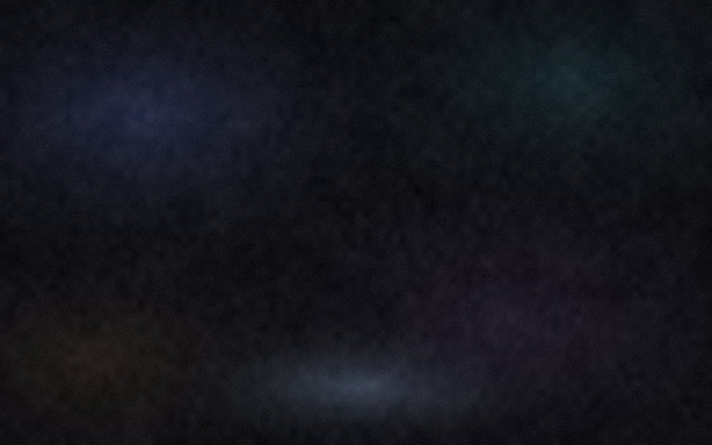

# native-glass（原生玻璃）

给 **DSH 桌面版**做的一层皮肤：**官方外观 + 毛玻璃输入框与浮层 + 通透底图**。

纯声明式 —— 只有 CSS 和图片，**没有 `hooks.mjs`、不执行任何代码**。

> 当前版本 **1.9.2**，作者 **念w月**。
> 本文是上手文档；踩坑因果链（Windows 外壳挡底图、皮肤管线选择器规则、"改了没反应" 的两层原因）全部写在 [`INSTALL.md`](INSTALL.md) 里，**要改皮肤请先读它**。

浅色 / 深色：




---

## 特性

- **通透底图**：画布与左侧栏共用同一套柔光底图，浓淡由「背景遮蔽」滑杆联动；换图只要替换 `native-glass/assets/frost-{light,dark}.jpg`。
- **毛玻璃输入卡**：输入卡本体是半透明磨砂，糊的是从输入框下面滚过去的正文。
- **浮层同材质**：`/` 命令面板、输入区配件弹层、模型提问卡 / 计划评审卡与输入卡共用一套玻璃材质（1.9.0 起拆分两档，浮层地板更高）。
- **修掉 Windows 专属的"外壳挡死底图"**：前端平台特化规则 + 皮肤 token 冲突的防御纵深修复，已做全量审计。
- **性能约束**：不使用任何 `:hover` 规则、不使用 `mask`；`backdrop-filter` 只出现在 3 处"无后代的 `::before`"上，避免 hover 反复重算导致的闪烁。

## 依赖

| 项 | 要求 |
|---|---|
| DSH | 桌面版（本皮肤在 `0.2.0-rc.2` 上验证：macOS 与 Windows 11 各一台） |
| 插件 | [`@linxin666/dsh-client-ui-skin-center`](https://www.npmjs.com/package/@linxin666/dsh-client-ui-skin-center) **0.4.4** |

## 安装

### 1) 装皮肤中心插件

```sh
dsh plugin --profile desktop add @linxin666/dsh-client-ui-skin-center@0.4.4
```

`dsh` CLI 位置：macOS `"/Applications/DeepSeek Harness.app/Contents/Resources/runtime/cli/bin/dsh"`；Windows 在安装目录 `resources\runtime\cli\bin\`。
profile 名必须是**那台机器 GUI 实际在用的**。也可以走 GUI：设置 → 插件。

### 2) 放皮肤

把 `native-glass/` 整个目录放到：

| 系统 | 目标路径 |
|---|---|
| macOS | `~/.dsh/skins/native-glass/` |
| Windows | `%USERPROFILE%\.dsh\skins\native-glass\` |

⚠️ **目录名必须正好是 `native-glass`**（= `skin.json` 里的 `id`），改名会出现"样式生效但背景图 404"。若设过 `DSH_HOME` / `DSH_SKINS_HOME` / `DSH_SKINS_DIR`，以那些为准。

放好后**不用重启**：设置 → 皮肤中心，重开卡片即收录。

### 3) 应用

设置 → 皮肤中心 → 「原生玻璃」→ **应用**。

## 推荐滑杆值（这套参数是调出来的）

| 滑杆 | 值 | 作用 |
|---|---|---|
| 背景遮蔽 | **0** | **联动旋钮**：画布 + 左侧栏 + 输入卡厚薄的共同系数 |
| 背景模糊（空对话 / 有内容） | **20 / 20** | 把底图的细颗粒糊成柔光 |
| 输入卡模糊 | **14** | 驱动"真磨砂层" |
| 气泡不透明度 | **0** | 0 = 消息没有底色；60~80 = 一层淡磨砂底 |
| 气泡模糊 | **0** | ⚠️ 自 1.8.1 起此滑杆不再生效（该层已移除，见 INSTALL.md §十一） |

底图浓淡公式：`alpha = 遮蔽 × 0.50 + 0.22`，画布与侧栏共用 ⇒ 遮蔽 0 = 最透，100 = 最实。

## 目录结构

```
native-glass-skin/
├── README.md                 # 本文件
├── INSTALL.md                # 安装 / 排障 / 原理（含全部踩坑记录）
└── native-glass/             # 皮肤本体，直接整个丢进 ~/.dsh/skins/
    ├── skin.json             # 清单（版本、id、贡献点）
    ├── skin.css              # 基础样式：画布、侧栏、输入卡、浮层材质 token
    ├── patches.css           # L3 自由选择器补丁：外壳透明化、配件 blur 中和、浮层材质重画
    ├── assets/               # 底图（frost-* 当前在用，backdrop-* 为早期无颗粒版备用）
    └── preview/              # 皮肤中心的预览图
```

## 版本要点

### 1.9.x —— 浮层毛玻璃

- **1.9.2** 浮层再调透一档：系数 `.18+.78` → **`.20+.72`**（遮蔽 0 时 0.72）。
- **1.9.1** 撤掉临时诊断探针；`.12+.86` → `.18+.78`。
- **1.9.0** **浮层与输入卡拆成两档玻璃材质**：新增 `--dsh-glass-fill-popover`；输入卡维持 `--dsh-glass-fill`（`.28+.50`）。理由：浮层压在正文上，地板天然该更高。
- **1.8.9** **真凶修复**：磨砂层从 `[data-composer-card]` 本体搬到它的 `::before`。祖先的 `backdrop-filter` 会形成"背景根"，而 `/` 命令面板恰恰是输入卡的后代 ⇒ 挂在本体上时面板等于没糊。
- **1.8.7 / 1.8.8** 统一浮层材质：按稳定属性锚点重画 MenuSurface 的材质层，并把 token 写进 **body 级选择器**（写在 `:root` 会被皮肤管线剥掉 `!important`，等于没写）。

完整 changelog（含 1.8.0~1.8.6 的闪烁 / 模糊斑修复）见 [`INSTALL.md` §十一](INSTALL.md)。

## 已知取舍

- 皮肤**不使用任何 `:hover` 规则**、**不使用 `mask`** —— 刻意的性能约束，改皮肤时请遵守。
- 消息正文的磨砂**只在有消息内容的会话里生效**（空首页不生效，这是插件设计的 gate）。
- 「背景遮蔽」是联动旋钮，动它同时影响画布、侧栏与输入卡厚薄。
- 皮肤走插件的 **L3（`patches.css` 自由选择器）**层，插件文档明确声明 L3 不构成安全边界。本皮肤纯声明式、无 `hooks.mjs`，但**从市场随手装的皮肤若有 `hooks.mjs` 属可执行代码**，装前值得看一眼。

## 退出方式

设置 → 皮肤中心 → 「官方默认」→ 应用；或直接删掉 `skins/native-glass/`。删皮肤不影响 DSH 本身。

## 许可

皮肤本体（CSS + 图片 + 清单）由本仓库提供，随附 [`INSTALL.md`](INSTALL.md)。皮肤中心插件 `@linxin666/dsh-client-ui-skin-center` 版权归其作者，本仓库不包含其分发物，请从 npm 安装。
