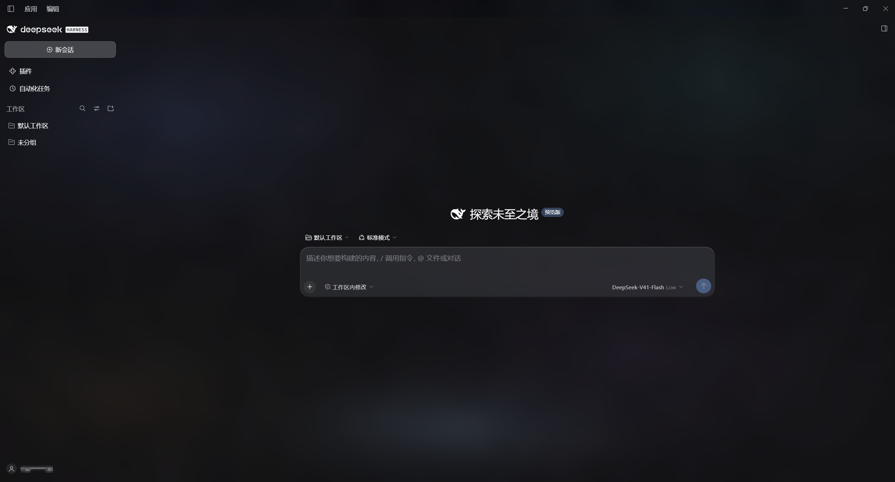

# native-glass（原生玻璃）

给 **DSH 桌面版**做的一层皮肤：**官方外观 + 毛玻璃输入卡与浮层 + 通透底图**。
纯声明式 —— 只有 CSS 和图片，**没有 `hooks.mjs`、不执行任何代码**。



| 浅色 | 深色 |
|---|---|
|  |  |

> 想省事：把 [安装 prompt](install-prompt.md) 里那段话原样丢给你的 DSH，让它自己装。

---

## 依赖

| 项 | 要求 |
|---|---|
| DSH | 桌面版（在 `0.2.0-rc.2` 上验证：macOS 与 Windows 11 各一台） |
| 插件 | [`@linxin666/dsh-client-ui-skin-center`](https://www.npmjs.com/package/@linxin666/dsh-client-ui-skin-center) **0.4.4** |

## 项目架构

```
native-glass-skin/
├── README.md                 # 本文件：架构 + 安装
├── install-prompt.md         # 可整段丢给 DSH、让它自动安装的 prompt
├── INSTALL.md                # 深度文档：排障清单、原理、完整 changelog（改皮肤前先读）
├── docs/preview-home.png     # README 用的实机截图
└── native-glass/             # ← 皮肤本体，整个目录就是安装单位
    ├── skin.json             # 清单：id=native-glass、version、贡献点（样式表 / 补丁 / 底图）
    ├── skin.css              # 【数据面】token 层：把 --dsw-* 系列变量改写成玻璃材质
    ├── patches.css           # 【选择器面】L3 层：官方没走 token 的地方按选择器打补丁
    ├── assets/               # 底图：frost-light/frost-dark.jpg（当前在用，皮肤中心滑杆驱动浓淡）
    │                         #       backdrop-*.jpg 是早期无颗粒版，未被引用，备用
    └── preview/              # 皮肤中心卡片用的浅/深色预览图
```

两层 CSS 的分工是这套皮肤的核心：

| 文件 | 层 | 管什么 | 典型内容 |
|---|---|---|---|
| `skin.css` | 数据面（token） | 能靠改 `--dsw-alias-*` / `--dsw-specific-*` / `--dsh-glass-*` 达成的走这里：改一处全局生效，不用拼长选择器 | 画布与侧栏底图浓淡、输入卡与浮层的玻璃填充、气泡透明度 |
| `patches.css` | 选择器面（L3 自由选择器） | 官方写死、token 改不动的地方 | Windows 外壳透明化、中和插件给配件强加的 `backdrop-filter`、浮层材质层重画 |

> ⚠️ **「数据面」不等于「免竞争」**：token 声明本身仍按 *特异性 + 文档顺序* 参与层叠，而且
> `--dsw-alias-*` / `--dsw-specific-*` 的 `:root` 声明会被管线**搬到 body**（其余名字不会）。
> macOS 上官方还有一条 `html[data-platform="darwin"] body{--dsw-specific-menu:#303136f0}`（(0,1,2)）兜底，
> 且官方样式是运行时 append 的、排在皮肤 `<link>` 之后 ⇒ 同分时**官方赢**。要压过它得写
> `body:not([data-ds-dark-theme])` / `body[data-ds-dark-theme]`（(0,2,2)）并（在非 `:root` 块里）加 `!important`。
> 1.8.7 那版"状态面板没有毛玻璃"就栽在这条上。
>
> ⚠️ 安装单位是 `native-glass/` **整个目录**，目录名必须**正好等于** `skin.json` 里的 `id`（`native-glass`）。
> 改名会出现"样式生效但背景图 404"。
>
> 皮肤管线会把源码选择器前面自动插一层作用域，并重写 `:root` / `body`、搬移 `--dsw-*` token —— 这些规则写在 [`INSTALL.md` §七](INSTALL.md)，**要改皮肤必读**。

## 安装

### 1) 装皮肤中心插件

```sh
dsh plugin --profile desktop add @linxin666/dsh-client-ui-skin-center@0.4.4
```

`dsh` CLI 位置：macOS `"/Applications/DeepSeek Harness.app/Contents/Resources/runtime/cli/bin/dsh"`；Windows 在安装目录 `resources\runtime\cli\bin\` 下。
profile 名必须是**你这台机器 GUI 实际在用的那个**（常见是 `desktop`）。也可以走 GUI：设置 → 插件。

### 2) 放皮肤

把仓库里的 `native-glass/` 整个目录复制到：

| 系统 | 目标路径 |
|---|---|
| macOS | `~/.dsh/skins/native-glass/` |
| Windows | `%USERPROFILE%\.dsh\skins\native-glass\` |

若设过 `DSH_HOME` / `DSH_SKINS_HOME` / `DSH_SKINS_DIR`，以那些为准。
放好后**不用重启**：设置 → 皮肤中心，重开卡片即收录。

### 3) 应用

设置 → 皮肤中心 → 「原生玻璃」→ **应用**。

### 4) 按推荐值拉滑杆（这套参数是调出来的）

| 滑杆 | 值 | 作用 |
|---|---|---|
| 背景遮蔽 | **0** | **联动旋钮**：画布 + 左侧栏 + 输入卡/提问卡 + **所有浮层** 厚薄的共同系数 |
| 背景模糊（空对话 / 有内容） | **20 / 20** | 把底图的细颗粒糊成柔光 |
| 输入卡模糊 | **14** | 驱动输入卡与**全部浮层**的磨砂强度（浮层的模糊也不再走官方的 40px） |
| 气泡不透明度 | **0** | 0 = 消息没有底色；60~80 = 一层淡磨砂底 |
| 气泡模糊 | **0** | ⚠️ 自 1.8.1 起此滑杆不再生效（该层已移除） |

底图浓淡公式：`alpha = 遮蔽 × 0.50 + 0.22`，画布与侧栏共用 ⇒ 遮蔽 0 = 最透，100 = 最实。

玻璃材质**分两档**（1.9.0 起），都是「背景遮蔽」的线性函数：

| 用在哪 | 公式 | 遮蔽 0（推荐值） | 遮蔽 100 |
|---|---|---|---|
| 输入卡 / 提问卡 / 计划评审卡 | `遮蔽 × 0.28 + 0.50` | 0.50 | 0.78 |
| **浮层**（`/` 命令面板、输入框下方配件弹层、悬浮卡…） | `遮蔽 × 0.20 + 0.72` | 0.72 | 0.92 |

浮层地板更高，因为它压在正文上、要压得住字。想单独调浮层厚薄，改 `native-glass/skin.css` 里两行
`--dsh-glass-fill-popover`（亮/暗各一行）：`.20` 是灵敏度、`.72` 是地板。
想换底图：替换 `native-glass/assets/frost-{light,dark}.jpg` 即可。

### 装完怎么确认真的生效

1. `GET {DSH地址}/api/skin-center/v2/catalog` → 在 `skins[]` 数组里找 `manifest.id == "native-glass"`，看它的 `manifest.version` 是否为 `1.9.2`、`warnings` 是否为空 —— **版本在这个数组里，顶层没有 `version` 字段**（解析错层会误判成"皮肤没被收录"）。`/api/skin-center/**` 这些路由**不需要登录**，裸 curl 就能验（只有首页 `/` 要 cookie）。
2. `GET {DSH地址}/api/skin-center/v2/skins/native-glass/assets/frost-dark.jpg` → 应 **200**（404 说明目录名不对）
3. 界面没变化 = 前端缓存，**强刷**（Ctrl+F5 / Cmd+Shift+R）
4. Windows 上画布/侧栏仍是纯色 ⇒ 见 [`INSTALL.md` §六](INSTALL.md)（外壳 token 冲突）

## 卸载 / 退出

设置 → 皮肤中心 → 「官方默认」→ 应用；或直接删掉 `skins/native-glass/`。删皮肤不影响 DSH 本身。

## 许可

皮肤本体（CSS + 图片 + 清单）由本仓库提供，随附 [`INSTALL.md`](INSTALL.md)。
皮肤中心插件 `@linxin666/dsh-client-ui-skin-center` 版权归其作者：**本仓库不含它的任何分发物**（`INSTALL.md` 里提到的 `linxin666-dsh-client-ui-skin-center-0.4.4.tgz` 不在仓库内，那是同名离线包里的文件），请从 npm 安装，或自行取得离线包。
